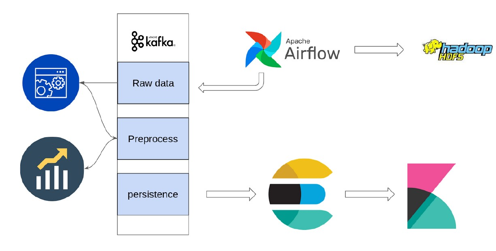

# Building a data pipeline on the Crypto market
In this project I implemented a real time data pipeline for crypto information and news about crypty which is ceawled from [this website](https://www.tgju.org/crypto).
I've used docker for runnig bigdata tools like HDFS, airflow, kafka, elasticsearch and kibana on a virtual containerThe flow of data in this pipeline is shown in below image  
  

This Project contains three main Parts:

## Part1:

## Part2:

## Part 3
