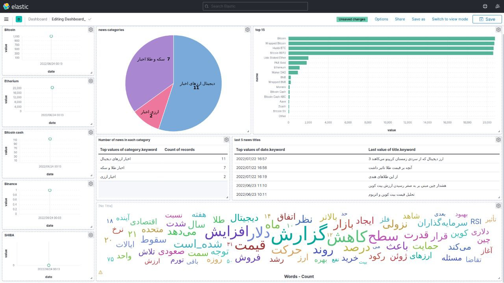

# Building a data pipeline on the Crypto market
In this project, I implemented a real-time data pipeline for crypto information and news about crypto which is crawled from [this website](https://www.tgju.org/crypto).
I've used docker for running bigdata tools like HDFS, airflow, Kafka, Elasticsearch and Kibana on a virtual container flow of data in this pipeline is shown in the below image  
  

This Project contains three main Parts:

## Part1:
In this Part, with the help of Apache Airflow, I crawled news and information about each crypto in defined time intervals. after preprocessing and cleaning downloaded data for each time interval, I designed an other dag in airflow for merging data of multiple intervals and saving them in HDFS, and also entering the data into the Kafka channel. 

## Part2:
All of Part 2 was about Apache Kafka. In this part, we have 3 different Kafka channels with their own producers and consumers. The channels are as follows:
- Data channel: data is written in this channel by airflow.
- Preprocess channel: data cleaning is done in this channel and data is sent to elasticsearch.
- Statics channel: future statics analysis is done in this channel.

writing and reading data in Kafka is done by the `kafka-python` library in python.

## Part 3
Saving data in elastic search and visualizing statistics using Kibana were the goals of this part. After saving data in Elasticsearch by `elastticsearch` library of python, I applied several visualization graphs with the help of Kibana and finally use them to design a live dashboard in Kibana. The dashboarded is in Persian language due to Persian data and is shown in the below image  
  

  
